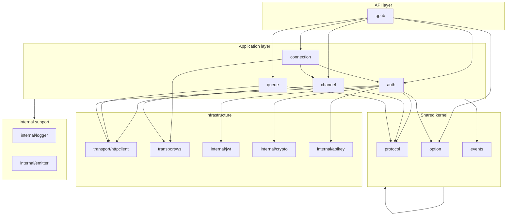

# qpub-go architecture

The Go SDK uses clear boundaries between protocol, ports, application logic, infrastructure, and the public facade. It is **not** backend-style DDD (no domain/application/infrastructure trees like qpub-backend). Structure is **Go-idiomatic**: packages by concern, `internal/` for non-public wiring, interfaces for testability, one composition root.

Cross-language API and parity tracking live in [implementation-status.md](./implementation-status.md) and [cross-sdk-api.md](./cross-sdk-api.md).

## Goals

- **Isolate layers** so protocol and use cases do not depend on HTTP/WebSocket details.
- **Scale** by adding features inside the right package without reshaping the module.
- **Avoid circular imports** via dependency direction and small port interfaces.
- **Expose Socket and Rest** with Go idioms (`context`, callbacks, functional options) rather than runtime DI or event emitters.

## Layer model



### Layer definitions

| Layer                   | Packages                                                            | Responsibility                                                                                                                                                      |
| ----------------------- | ------------------------------------------------------------------- | ------------------------------------------------------------------------------------------------------------------------------------------------------------------- |
| **API**                 | module root (`package qpub`)                                        | Only stable entry points: `NewSocket`, `NewRest`, re-exported types, event name constants, consumer-facing interfaces. Wires dependencies (composition root).       |
| **Application**         | `auth/`, `connection/`, `channel/`, `queue/`                        | Use cases: authenticate, connect/reconnect, subscribe/publish, enqueue/worker loop. Depends on **ports** (HTTP, WS, options, logger) and **kernel**, not on `qpub`. |
| **Shared kernel**       | `protocol/`, `option/`, `events/`                                   | Wire DTOs, config defaults, event names/payload shapes. No I/O, no managers.                                                                                        |
| **Infrastructure**      | `transport/*`, `internal/jwt`, `internal/crypto`, `internal/apikey` | Real HTTP/WebSocket, crypto, JWT. Implements behavior behind small interfaces where possible.                                                                       |
| **Internal support**    | `internal/logger`, `internal/emitter`                               | Cross-cutting helpers; not imported by `protocol/` or `option/`.                                                                                                    |
| **Testing (consumers)** | `testing/`                                                          | Mocks and test constructors; may import `qpub` and `option`.                                                                                                        |
| **Examples**            | `examples/`                                                         | Sample programs; import `qpub` only.                                                                                                                                |

## Import rules (dependency direction)

Allowed imports flow **downward** only. If a change requires an upward import, introduce or extend a **port interface** in the kernel/application boundary instead.

| From                              | May import                                                                      | Must not import                                                                 |
| --------------------------------- | ------------------------------------------------------------------------------- | ------------------------------------------------------------------------------- |
| `protocol`, `option`, `events`    | std library only                                                                | `auth`, `channel`, `connection`, `queue`, `transport`, `qpub`, `testing`        |
| `internal/*`                      | std, `option` (logger only if needed)                                           | `qpub`, `auth`, `channel`, `connection`, `queue`                                |
| `transport/*`                     | std, `internal/logger` (optional)                                               | `qpub`, `auth`, `channel`, `connection`, `queue`                                |
| `auth`, `queue`, `channel` (REST) | `option`, `protocol`, `events`, `internal/*`, `internal/port` (HTTP)            | `qpub`, `connection` (REST managers only; socket channel uses `MessageSender`)  |
| `connection`                      | `option`, `protocol`, `events`, `auth`, `channel`, `transport/ws`, `internal/*` | `qpub`, `queue`                                                                 |
| `channel`                         | `option`, `protocol`, `events`, `auth`, `transport/*`, `internal/*`             | `qpub`, `connection` (avoid: connection orchestrates channels, not the reverse) |
| `qpub`                            | all application + kernel + transport packages used for wiring                   | `testing`                                                                       |
| `testing`                         | `qpub`, `option`, `auth`, … for mocks                                           | —                                                                               |
| `examples/*`                      | `qpub`, `channel` (subscribe options), std                                      | `internal/*`, `transport/*` directly                                            |

**Circular import avoidance in Go**

1. **Connection ↔ channel**: `connection` imports `channel` for resubscribe/dispatch; `channel` must not import `connection`. Socket lifecycle stays in `connection`.
2. **Auth ↔ HTTP**: prefer `auth.HTTPDoer` (small interface) over concrete `httpclient.Client` in tests and future refactors.
3. **Shared types**: keep wire types in `protocol/`; do not duplicate DTOs in `auth` or `queue`.
4. **New subpackages**: if two application packages need each other, extract shared contracts to `protocol/`, `events/`, or `internal/port/`.

## Composition root

All runtime wiring for `Socket` and `Rest` lives in:

- [socket.go](../socket.go)
- [rest.go](../rest.go)

New dependencies (custom HTTP client, logger, clock) should be added here (or in a future `internal/bootstrap/` package called only from `qpub`), not scattered across application packages.

## Public surface

Consumers should depend on:

```go
import "github.com/qpubio/qpub-go"
```

Advanced testing:

```go
import "github.com/qpubio/qpub-go/testing"
```

Do not document or encourage importing `internal/*` or `transport/*` from application code outside this module.

## Concurrency conventions

- **Per-channel message handlers**: run serially for a given `SocketChannel` unless documented otherwise.
- **Connection read loop**: one goroutine demuxes WebSocket frames; dispatches to channel manager.
- **Lifecycle**: prefer `context.Context` for cancel; `Reset()` on Socket/Rest order: connection → channels → auth → options.

## Current layout vs target (evolution)

| Concern   | Current                                     | Target (incremental)                                                                         |
| --------- | ------------------------------------------- | -------------------------------------------------------------------------------------------- |
| Ports     | [internal/port/http.go](../internal/port/http.go), [interfaces.go](../interfaces.go) | Optional `internal/port/websocket.go` if WS mocking grows |
| Bootstrap | Inline in root `*.go` (`package qpub`)      | Optional `internal/bootstrap/socket.go`, `rest.go` if wiring grows                           |
| Event bus | `internal/emitter`                          | Keep internal; expose typed callbacks on managers/connection                                 |
| Logger    | `internal/logger`                           | Optional `port.Logger` for custom sinks                                                      |

No big-bang rename required: new code follows import rules; existing code is tightened when touched.

## Adding a feature (checklist)

1. Wire/protocol change → `protocol/` (+ tests).
2. Config → `option/` (+ defaults documented in code).
3. Use case → appropriate application package (`auth`, `channel`, `connection`, `queue`).
4. I/O → `transport/` or `internal/`.
5. Export types/constants → `doc.go` or `interfaces.go` at module root.
6. Wire in `NewSocket` or `NewRest`.
7. Update [implementation-status.md](./implementation-status.md) when parity phase completes.

## Related

- [implementation-status.md](./implementation-status.md) — plan phases and completion state
- [cross-sdk-api.md](./cross-sdk-api.md) — JavaScript vs Go API
